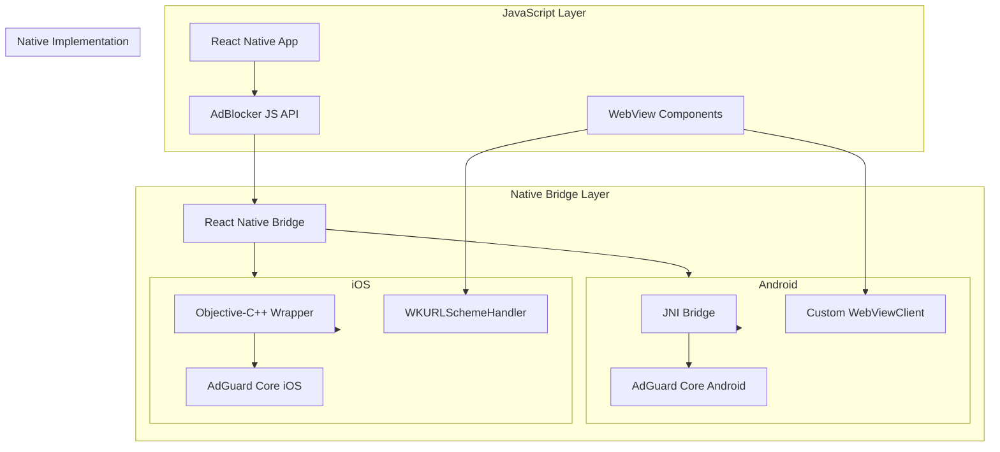

# AdGuard Integration Design Document

## Overview

This design implements AdGuard Core library integration into a React Native application to provide comprehensive ad blocking capabilities within WebViews. The solution uses a native module architecture with platform-specific implementations for Android (Java/Kotlin + JNI) and iOS (Objective-C++ + Swift), exposing a unified JavaScript API for ad blocking control.

The design prioritizes performance, maintainability, and seamless integration with existing React Native WebView components while ensuring minimal app size impact and real-time filtering capabilities.

## Architecture

### High-Level Architecture



### Component Interaction Flow

1. **Initialization**: JavaScript calls `AdBlocker.init()` → Native modules initialize AdGuard Core
2. **Request Interception**: WebView requests → Platform-specific interceptors → AdGuard filtering → Allow/Block decision
3. **Filter Management**: JavaScript controls → Native bridge → AdGuard Core filter updates

## Components and Interfaces

### JavaScript API Interface

```typescript
interface AdBlockerModule {
  init(): Promise<boolean>;
  enable(): Promise<void>;
  disable(): Promise<void>;
  filterRequest(url: string): Promise<boolean>;
  updateFilters(): Promise<void>;
  isEnabled(): Promise<boolean>;
}
```

### Android Implementation

#### Native Module Structure
- **AdBlockerModule.java**: React Native module entry point
- **AdBlockerManager.java**: Core filtering logic manager
- **AdGuardJNIBridge.cpp**: JNI interface to AdGuard Core
- **CustomWebViewClient.java**: WebView request interceptor

#### Key Android Components

```java
// AdBlockerModule.java - React Native Module
@ReactModule(name = AdBlockerModule.NAME)
public class AdBlockerModule extends ReactContextBaseJavaModule {
    public static final String NAME = "AdBlocker";
    
    @ReactMethod
    public void init(Promise promise) {
        // Initialize AdGuard Core through JNI
    }
    
    @ReactMethod
    public void filterRequest(String url, Promise promise) {
        // Filter URL through AdGuard Core
    }
}

// CustomWebViewClient.java - Request Interceptor
public class AdBlockingWebViewClient extends WebViewClient {
    @Override
    public WebResourceResponse shouldInterceptRequest(WebView view, WebResourceRequest request) {
        if (AdBlockerManager.shouldBlock(request.getUrl().toString())) {
            return new WebResourceResponse("text/plain", "utf-8", new ByteArrayInputStream("".getBytes()));
        }
        return super.shouldInterceptRequest(view, request);
    }
}
```

#### JNI Bridge Design
- **Minimal JNI surface**: Only essential filtering functions exposed
- **Thread-safe operations**: AdGuard Core calls wrapped in thread-safe context
- **Memory management**: Proper cleanup of native resources

### iOS Implementation

#### Native Module Structure
- **AdBlockerModule.m**: React Native module entry point
- **AdBlockerManager.mm**: Objective-C++ manager class
- **AdGuardWrapper.mm**: C++ wrapper for AdGuard Core
- **AdBlockingURLSchemeHandler.m**: WKURLSchemeHandler implementation

#### Key iOS Components

```objc
// AdBlockerModule.m - React Native Module
@implementation AdBlockerModule

RCT_EXPORT_MODULE();

RCT_EXPORT_METHOD(init:(RCTPromiseResolveBlock)resolve
                  rejecter:(RCTPromiseRejectBlock)reject) {
    // Initialize AdGuard Core through C++ wrapper
}

RCT_EXPORT_METHOD(filterRequest:(NSString *)url
                  resolver:(RCTPromiseResolveBlock)resolve
                  rejecter:(RCTPromiseRejectBlock)reject) {
    // Filter URL through AdGuard Core
}

@end

// AdBlockingURLSchemeHandler.m - Request Interceptor
@implementation AdBlockingURLSchemeHandler

- (void)webView:(WKWebView *)webView startURLSchemeTask:(id<WKURLSchemeTask>)urlSchemeTask {
    NSString *url = urlSchemeTask.request.URL.absoluteString;
    if ([[AdBlockerManager shared] shouldBlockURL:url]) {
        // Block the request
        return;
    }
    // Allow the request
}

@end
```

### AdGuard Core Integration

#### Filter Engine Architecture
- **Filter Lists**: EasyList, EasyPrivacy, AdGuard Base filters
- **Rule Engine**: Pattern matching for URLs, domains, and content types
- **Performance Optimization**: Compiled filter rules for fast lookup

#### Memory Management
- **Lazy Loading**: Filter rules loaded on-demand
- **Cache Strategy**: Frequently used rules cached in memory
- **Resource Cleanup**: Proper disposal of filter engine resources

## Data Models

### Filter Rule Model
```typescript
interface FilterRule {
  id: string;
  pattern: string;
  type: 'block' | 'allow' | 'redirect';
  domains?: string[];
  contentTypes?: string[];
  isEnabled: boolean;
}
```

### Filter List Model
```typescript
interface FilterList {
  id: string;
  name: string;
  url: string;
  version: string;
  lastUpdated: Date;
  rules: FilterRule[];
  isEnabled: boolean;
}
```

### Configuration Model
```typescript
interface AdBlockerConfig {
  isEnabled: boolean;
  filterLists: FilterList[];
  customRules: FilterRule[];
  whitelistedDomains: string[];
  performanceMode: 'balanced' | 'aggressive' | 'minimal';
}
```

## Error Handling

### JavaScript Layer Error Handling
- **Promise-based API**: All async operations return promises with proper error handling
- **Error Types**: Initialization errors, filtering errors, network errors
- **Fallback Behavior**: Graceful degradation when native module fails

### Native Layer Error Handling
- **Exception Safety**: All native calls wrapped in try-catch blocks
- **Resource Management**: RAII pattern for automatic resource cleanup
- **Logging**: Comprehensive logging for debugging and monitoring

### Error Recovery Strategies
1. **Initialization Failure**: Disable ad blocking, log error, continue app operation
2. **Filter Update Failure**: Use cached filters, retry with exponential backoff
3. **Runtime Filtering Error**: Allow request through, log error for analysis

## Testing Strategy

### Unit Testing
- **JavaScript API Tests**: Jest tests for all public API methods
- **Native Module Tests**: Platform-specific unit tests for core filtering logic
- **JNI/Bridge Tests**: Tests for data marshaling between JavaScript and native code

### Integration Testing
- **WebView Integration**: Tests for request interception in real WebView scenarios
- **Filter Effectiveness**: Tests against known ad/tracker URLs
- **Performance Tests**: Memory usage and response time benchmarks

### End-to-End Testing
- **Real Website Testing**: Load actual websites with ads and verify blocking
- **Cross-Platform Testing**: Ensure consistent behavior across Android and iOS
- **Hot Reload Testing**: Verify React Native development workflow compatibility

### Performance Testing
- **Memory Profiling**: Monitor memory usage during filtering operations
- **CPU Usage**: Measure filtering overhead during WebView navigation
- **App Size Impact**: Verify final app size increase stays under 5MB limit

## Implementation Considerations

### Build System Integration

#### Android Build Configuration
```gradle
// android/app/build.gradle
android {
    compileSdkVersion 34
    
    defaultConfig {
        minSdkVersion 24  // API 24+ requirement
        ndk {
            abiFilters "arm64-v8a", "armeabi-v7a", "x86", "x86_64"
        }
    }
    
    externalNativeBuild {
        cmake {
            path "src/main/cpp/CMakeLists.txt"
        }
    }
}

dependencies {
    implementation 'com.adguard:adguard-core:1.0.0'  // Hypothetical dependency
}
```

#### iOS Build Configuration
```ruby
# ios/Podfile
target 'Moview' do
  # ... existing pods
  
  pod 'AdGuardCore', '~> 1.0'  # Hypothetical pod
  
  post_install do |installer|
    installer.pods_project.targets.each do |target|
      target.build_configurations.each do |config|
        config.build_settings['IPHONEOS_DEPLOYMENT_TARGET'] = '13.0'
      end
    end
  end
end
```

### WebView Integration Strategy

#### Extending react-native-webview
- **Custom WebView Component**: Extend existing WebView with ad blocking capabilities
- **Backward Compatibility**: Maintain existing WebView API while adding ad blocking
- **Opt-in Behavior**: Ad blocking enabled through props, not globally

```typescript
// Enhanced WebView Component
interface AdBlockingWebViewProps extends WebViewProps {
  adBlockingEnabled?: boolean;
  customFilters?: string[];
  onAdBlocked?: (url: string) => void;
}
```

### Performance Optimizations

#### Filter Rule Compilation
- **Preprocessing**: Compile filter rules into optimized data structures
- **Bloom Filters**: Use probabilistic data structures for fast initial filtering
- **Trie Structures**: Efficient pattern matching for URL filtering

#### Memory Management
- **Lazy Loading**: Load filter rules only when needed
- **LRU Cache**: Cache frequently accessed filter decisions
- **Background Processing**: Update filters on background threads

#### Network Optimization
- **Batch Updates**: Group filter list updates to minimize network requests
- **Compression**: Use compressed filter list formats
- **Incremental Updates**: Download only changed filter rules when possible